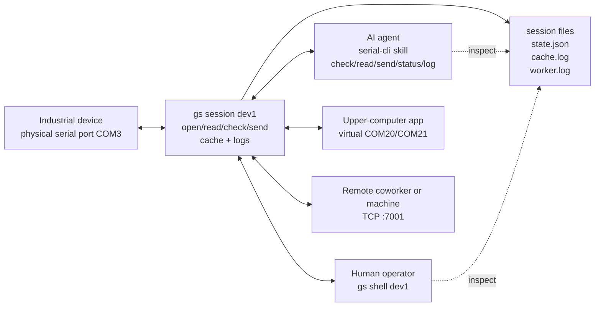
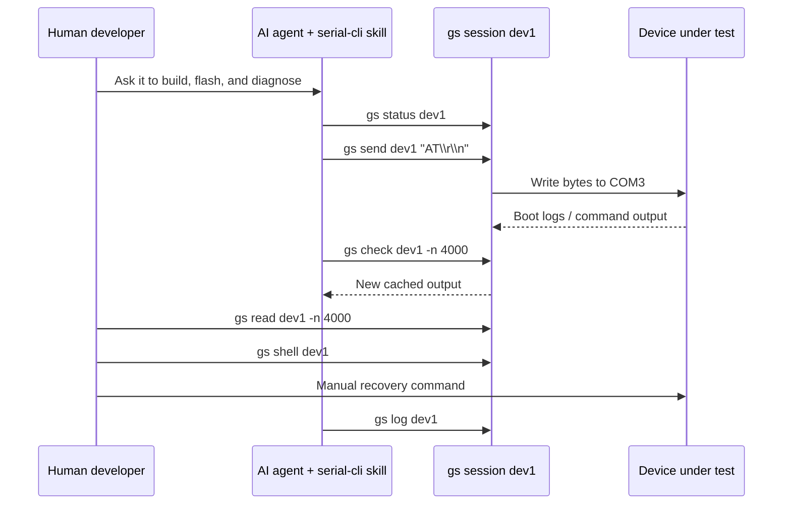
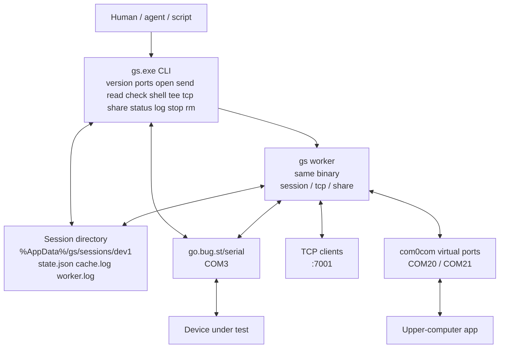
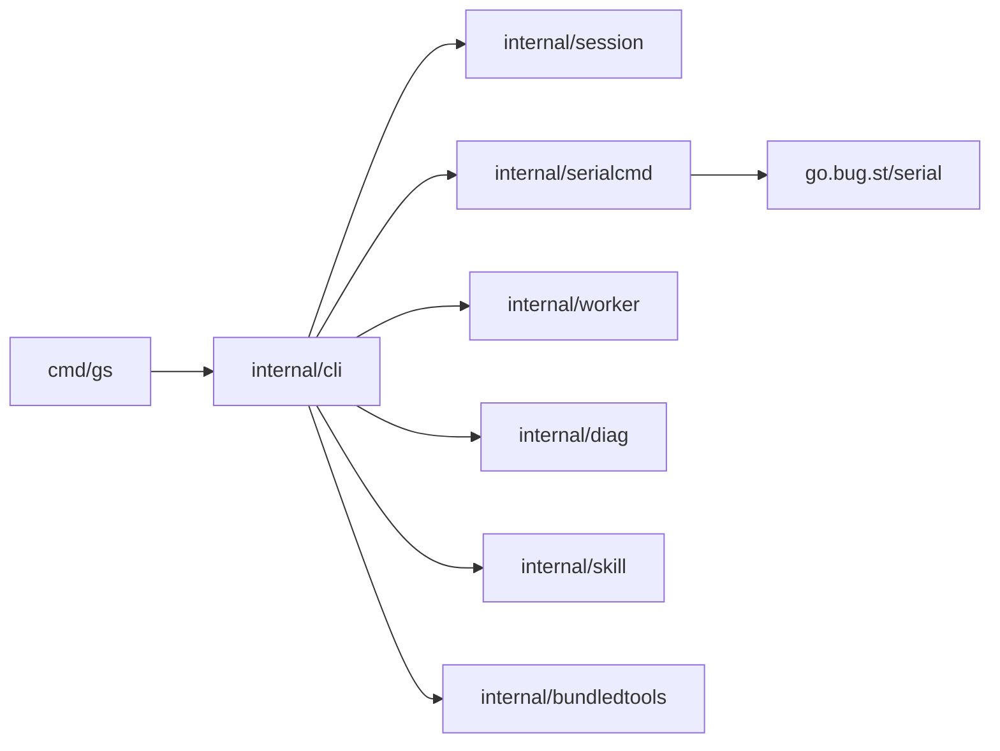

# go-serial-cli

[简体中文](README.zh-CN.md)

`gs` is a small Go CLI for working with serial ports on Windows. It is meant for
real debug benches: industrial PCs, vendor tools, upper-computer apps, firmware
flashing, and the cases where a human and an agent both need to work with the
same device.

For now, the tool should stay simple: one binary, short commands, local files for
state and logs, and cleanup that only touches the session you named.

## Quick start

```bash
gs version
gs ports
gs open dev1 COM3 -b 115200
gs send dev1 "AT\r\n"
gs ask dev1 "AT\r\n"
gs read dev1 -n 200
gs check dev1 -n 200
gs stop dev1
```

`gs open` records a named session and starts a background worker that keeps the
physical port open, reads serial output, and appends it to `cache.log`.
Commands such as `send`, `ask`, `read`, `check`, and `shell` coordinate through
that named session.

```bash
gs shell dev1
gs tee dev1 serial.log
gs tcp dev1 :7001
gs share dev1 COM20 COM21
```

Clean up only the session you named:

```bash
gs stop dev1
gs rm dev1
```

`stop` releases live resources and leaves the session files. `rm` performs the
same live cleanup, then deletes that session's state, cache, and logs.

## Why Windows first

Most industrial PCs, factory test stations, embedded benches, and vendor debug
tools still run on Windows. Linux and macOS already have good terminal tools for
this kind of work. On Windows, serial work is often split across GUI tools,
vendor utilities, virtual COM drivers, and small scripts.

`gs` starts there. Serial enumeration, console input, process cleanup, com0com
sharing, logs, and manual intervention need to work well on a real Windows
machine before the project spends much time on other platforms.

## Who uses it

Use `gs` when you need to:

- list local serial ports.
- name a device once, then send/read/check it repeatedly.
- send exact bytes such as CRLF, Ctrl+C, ESC, or Ctrl+D.
- keep a foreground serial shell or tee running when a human needs to step in.
- cache serial output so humans, scripts, and agents can inspect it later.
- expose a serial device over TCP for remote control or observation.
- share a physical port through com0com virtual COM ports.
- install an agent skill that teaches Codex or Claude how to use this CLI.

The primary platform is Windows. Linux support should remain possible, but
Windows serial behavior, console handling, process cleanup, and com0com workflows
take priority.

## Collaboration model

`gs` is not just an agent helper. A common hardware bench has several things
looking at the same serial device: a human, an agent, a vendor upper-computer
program, and sometimes a remote process.

A typical setup might look like this:

- an agent uses the installed skill to call `gs send`, `gs check`, `gs read`,
  `gs status`, and `gs log`.
- a human opens `gs shell dev1` when the device needs manual recovery.
- an upper-computer application connects through virtual COM ports created by
  `gs share dev1 COM20 COM21`.
- a remote process connects through `gs tcp dev1 :7001`.
- everyone can inspect the same cache and logs instead of depending on one
  terminal's scrollback.

That is the main reason for named sessions, cached output, `tcp`, and `share`.
The tool should make ownership visible and cleanup predictable.

## Typical scenarios

### Shared serial bench

The most important case is one physical serial port with several observers or
operators around it. Without a small coordinating tool, people usually end up
fighting over the COM port, losing terminal output, or asking someone else to
copy logs from a GUI window.

With `gs`, the physical port is named once:

```powershell
gs open dev1 COM3 -b 115200
```

Then different tools can attach in different ways:

- the AI agent reads logs with `gs check dev1` and sends exact bytes with
  `gs send dev1 "AT\r\n"`.
- the human opens `gs shell dev1` when manual judgment is needed.
- the upper-computer app connects to a virtual COM port created by
  `gs share dev1 COM20 COM21`.
- a remote coworker or machine connects through `gs tcp dev1 :7001`.
- everyone can inspect `cache.log` and `worker.log`.



The exact ownership still matters. A command should say which session it is
touching, and `gs stop dev1` should only clean up `dev1`. That is what makes this
safe enough for a bench where a human, an agent, and a vendor tool are all active
at the same time.

### Agent-driven development with human control

The other common case is using an AI agent to drive firmware or device-side
development. The agent can build code, flash a board, send serial commands, read
boot logs, and summarize failures. `gs` gives the agent a small and repeatable
serial interface instead of asking it to operate a GUI terminal.

The human is still in the loop:

- read the same cached output the agent reads.
- interrupt with `gs shell dev1` when the device needs a manual recovery step.
- use `gs pause dev1` before a flash or burn step that needs exclusive access.
- inspect `gs status dev1` and `gs log dev1` when the agent reports a failure.
- modify the session with normal CLI commands instead of editing hidden state.



This is the operating model the skill is meant to support: agent-driven, but not
agent-only. The human can observe, interrupt, and change course at any point.

## Not goals right now

`gs` is not a daemon-based serial service yet. Background workers exist for
long-running modes such as `tcp`, `share`, and session control, but normal usage
should still look like a short CLI:

```bash
gs open dev1 COM3 -b 115200
gs send dev1 "AT\r\n"
gs check dev1 -n 200
gs stop dev1
```

Remote skill registries, plugin execution, dependency management, and automatic
driver installation can wait. The basic commands need to be reliable first.

## Install gs

There is no package manager or installer flow yet. For now, install from source.

Prerequisites:

- Go 1.22 or newer: https://go.dev/dl/
- Git, if you are cloning the repository.

From the repository root:

```powershell
go test ./...
go install ./cmd/gs
```

On Windows, if `GOBIN` is unset, Go installs the binary under:

```text
%GOPATH%\bin\gs.exe
```

For the default Go setup this is usually:

```text
C:\Users\<you>\go\bin\gs.exe
```

Make sure that directory is on `PATH`, then check which binary will run:

```powershell
Get-Command gs
gs version
```

If you only want a local build without installing to `PATH`:

```powershell
go build -o bin/gs.exe ./cmd/gs
.\bin\gs.exe version
```

For development builds with version metadata:

```powershell
$commit = git rev-parse --short HEAD
if (git status --porcelain) { $commit = "$commit-dirty" }
$builtAt = Get-Date -Format "yyyy-MM-ddTHH:mm:sszzz"
go install -ldflags "-X go-serial-cli/internal/cli.BuildVersion=dev -X go-serial-cli/internal/cli.BuildCommit=$commit -X go-serial-cli/internal/cli.BuildBuiltAt=$builtAt" ./cmd/gs
```

## Dependencies

Build-time Go modules are downloaded by the Go toolchain:

- `go.bug.st/serial`: https://pkg.go.dev/go.bug.st/serial
- `golang.org/x/sys`: https://pkg.go.dev/golang.org/x/sys
- `github.com/creack/goselect`: https://pkg.go.dev/github.com/creack/goselect

Runtime dependencies depend on what you use:

- Basic commands such as `version`, `ports`, `open`, `send`, `read`, `check`,
  `shell`, `tee`, `tcp`, `status`, and `log` need only `gs.exe`.
- `gs share` needs com0com installed on Windows, with `setupc.exe` available on
  `PATH` or in a standard Program Files install location.
- The `gs share` worker uses the Go bridge built into `gs` after com0com
  creates the virtual COM pairs.

Download com0com from:

```text
com0com project site: https://com0com.com/
com0com SourceForge project: https://sourceforge.net/projects/com0com/
```

Install the driver manually. `gs` should not silently install kernel drivers.
This repository does not vendor or redistribute com0com installers.

## Command model

### Discovery and setup

```bash
gs version
gs -v
gs ports
gs open dev1 COM3 -b 115200
gs list
gs status dev1
```

Sessions are named so multiple devices, terminals, or agents do not accidentally
control each other's serial resources. Mutating commands should operate on one
named session, never on every session as a side effect.

### Sending bytes

```bash
gs send dev1 "AT\r\n"
gs send dev1 "\x03"
gs send dev1 "\cC"
gs send dev1 "\x1b"
gs send dev1 "\x04"
gs ask dev1 "AT\r\n"
gs ask dev1 "ATI\r\n" -t 1.5 -l 5
```

Payloads support explicit escapes:

| Escape | Meaning |
| --- | --- |
| `\r` | carriage return |
| `\n` | line feed |
| `\t` | tab |
| `\xNN` | one hexadecimal byte |
| `\cX` | ASCII control character `Ctrl+X` |

Bare forms such as `^C` are ordinary text. This keeps literal payloads
unambiguous.

`gs ask` sends one payload, then reads fresh serial response data for a short
window. The default window is 0.5 seconds and the default output is the last 50
response lines. Use `-t <seconds>` to change the window and `-l <lines>` to
print the last N lines. `-l 0` disables the line limit.

### Reading cached output

```bash
gs read dev1 -n 200
gs read dev1 --to serial-cache.log
gs read dev1 -n 4096 --to recent.log
gs check dev1 -n 200
gs check dev1 --rewind 2000
gs check dev1 --from 0 --to checked.log
gs clear dev1
```

`gs read` is non-destructive. It views `cache.log` and never advances a cursor,
consumes bytes, or truncates the cache.

`gs check` is incremental. It reads from the saved check cursor and advances that
cursor only to the bytes it emitted. Use `--rewind <bytes>` to back up from the
saved cursor, or `--from <offset>` to inspect from an absolute cache offset.

Use `--to <file>` for large output so the CLI streams data into a file instead
of dumping it to the terminal.

### Live owners

```bash
gs shell dev1
gs tee dev1 serial.log
gs tcp dev1 :7001
gs share dev1 COM20 COM21
```

`gs shell` connects to the running named session in the foreground, prints serial
output, and writes stdin to the port. Exiting shell leaves the background worker
running. Use escaped line endings such as `AT\r\n` when the device expects CRLF.
On Windows, one Ctrl+C sends byte `0x03` to the device; a second interrupt
shortly after exits the shell.

`gs tee` keeps the port open in the foreground and writes serial output to the
terminal, the requested file, and the session cache.

`gs tcp` starts a background worker that accepts TCP clients and bridges them to
the named serial session.

`gs share` uses com0com plus the built-in Go byte bridge to share the named
physical serial session through virtual COM ports. Driver installation remains
explicit; `gs` should fail with an actionable error if com0com's `setupc.exe`
is not available.

### Lifecycle and diagnostics

```bash
gs pause dev1
gs resume dev1
gs status dev1
gs log dev1
gs stop dev1
gs rm dev1
```

`pause` and `resume` update local session state for workflows that need temporary
exclusive access, such as burn or flash steps.

`status` reports saved resources and PID liveness as `running`, `stale`, or
`stopped`. `stale` means a PID is saved in state but the matching process no
longer appears to be running. `gs stop dev1` should still be safe and should
clean only `dev1`.

## Design goals

### Keep the public CLI short

Commands should describe the user's job, not the internal architecture. Prefer:

```bash
gs open dev1 COM3
gs tcp dev1 :7001
```

over exposing words such as `session`, `forward`, `supervisor`, or `backend` in
normal workflows.

### Make bytes explicit

Serial debugging often depends on exact bytes. `gs` should make CRLF, Ctrl+C,
ESC, Ctrl+D, and other control bytes explicit through escapes instead of
guessing what a shorthand might mean.

### Treat sessions as isolation boundaries

A session name is a safety boundary. `gs stop dev1` and `gs rm dev1` must not
stop another session, remove another device's virtual ports, or delete unrelated
logs. This matters when multiple agents or humans are controlling different
devices on the same Windows machine.

### Support human and agent collaboration

The CLI has to work for both direct human use and agent calls. Humans need
readable commands, clear errors, and an interactive shell. Agents need stable
output, cache files, incremental reads, logs, and a small skill that explains the
right workflow.

### Make sharing a normal workflow

Industrial debugging often has more than one observer. A vendor upper-computer
tool, an agent, a human shell, and a remote process may all need to work around
the same physical port. `gs tcp`, `gs share`, cache files, and logs are the
pieces that make that possible.

### Prefer inspectable local state

Session state and logs are files under the user config directory. This makes
failures diagnosable with ordinary tools and avoids hiding important state inside
a daemon that may or may not be running.

### Keep driver installation explicit

Creating virtual COM pairs requires system-level drivers. `gs share` uses
com0com for those pairs, but it should not silently install drivers. Missing
prerequisites should produce clear setup guidance.

### Prove the CLI before adding a daemon

The command shape, state model, cleanup rules, and Windows behavior should settle
down before a daemon or backend process is added.

## System architecture

`gs` is a CLI first. The user runs commands, and those commands read or update a
named session directory under the user config path. Some modes start a background
`gs worker`, but that worker is still the same binary. There is no separate
daemon to install or manage.



The simple commands are short-lived:

- `gs ports` asks `go.bug.st/serial` for available ports.
- `gs open dev1 COM3 -b 115200` writes `state.json`, starts a background
  session worker, and keeps the configured port open until `stop` or `rm`.
- `gs send dev1 ...` sends bytes through the session worker when it is running.
- `gs ask dev1 ...` sends bytes through the session worker when it is running,
  then reads a short response window from newly cached output.
- `gs read` and `gs check` read `cache.log`.

The live modes keep something open:

- `gs shell` and `gs tee` run in the foreground.
- `gs tcp` records a TCP address and starts a worker that bridges TCP clients to
  the serial port.
- `gs share` creates virtual COM pairs with com0com and starts a worker that
  runs the built-in Go byte bridge.

The cache is the shared observation point. Workers and foreground readers append
serial output to `cache.log`; humans and agents can read the same bytes later.

## Software architecture

The code is split so command parsing, serial I/O, session files, and helper tool
logic stay separate.

```text
cmd/gs/                 executable entrypoint
internal/cli/           command parsing and command behavior
internal/serialcmd/     serial I/O, streaming, TCP bridge, session server
internal/session/       state.json, cache.log, check cursor, log paths
internal/worker/        retry policy for long-running workers
internal/diag/          clear user-facing diagnostic errors
internal/skill/         bundled skill installation
internal/bundledtools/  compatibility stubs for removed third-party bundles
tests/                  behavior tests grouped by feature
```

The main dependency direction is:



`internal/cli` owns the command names and user-visible behavior. It should not
grow hardware-specific code when that code can live in `internal/serialcmd`,
`internal/session`, or small helper packages.

`internal/serialcmd` owns the serial adapter layer. Core serial behavior should
go through `go.bug.st/serial`. Do not replace normal serial operations with
PowerShell, WMI, or ad-hoc OS command parsing. PowerShell is fine for temporary
diagnostics during development.

`internal/session` owns local files. It should be boring: validate session names,
resolve paths, load and save state, read and write cache data, and append logs.

`internal/skill` is file installation for agent context. It is not a plugin
runtime.

`internal/bundledtools` is a compatibility stub for older `tools extract`
callers. Third-party executables are external dependencies and are not
distributed from this repository.

## Session files

On Windows, session files live under:

```text
%AppData%/gs/sessions/<session>/
```

Important files:

```text
state.json
cache.log
worker.log
```

Use `gs log <session>` for `worker.log` when diagnosing sessions and share
workers.

When `worker_state` is `stopped`, nothing is appending fresh serial output in
the background. `read` and `check` can still inspect old cached bytes, but they
are not live device reads. Run `gs open <session> <port> -b <baud>` to restart
the session worker.

## Windows setup

Install com0com manually before using `gs share`:

```text
com0com project site: https://com0com.com/
com0com SourceForge project: https://sourceforge.net/projects/com0com/
```

After installing com0com, make sure `setupc.exe` is on `PATH`, or installed in a
standard com0com location under `Program Files`.

The `gs share` path uses the Go bridge built into `gs`, after com0com has
created the virtual COM pairs. `gs` does not bundle or extract third-party
executables.

## Skill installation

`gs` can install the bundled `serial-cli` skill for agent context:

```bash
gs skill install
gs skill install --to codex
gs skill install --to claude
gs skill install --to ./.tmp-skills
```

Default install targets both:

```text
~/.codex/skills/serial-cli
~/.claude/skills/serial-cli
```

Custom `--to <dir>` installs under `<dir>/serial-cli`. This is file installation
for agent instructions, not a runtime plugin system.

## Roadmap

### 1. Stabilize the Windows CLI core

- keep `ports`, `open`, `send`, `shell`, `tee`, `read`, `check`, `clear`,
  `status`, `log`, `stop`, `rm`, and `list` predictable.
- improve Windows console behavior for interactive serial shells.
- keep exact-byte payload handling well tested.
- make stale process cleanup idempotent and session-scoped.

### 2. Harden long-running ownership

- improve diagnostics and retry behavior for `tcp`, `share`, and background
  workers.
- keep worker and hub logs useful enough for hardware debugging.
- make mode transitions explicit when switching a session between shell, tee,
  TCP, and virtual-port sharing workflows.
- sharpen the shared-port workflow so upper-computer tools, agents, human
  shells, and remote TCP clients can cooperate with clear ownership.

### 3. Polish installation and agent workflows

- keep `gs skill install` minimal and dependency-free.
- document the manual Windows checks needed before asking a human to test
  hardware behavior.
- keep the installed skill aligned with the CLI's actual command shape.

## Build and test

```bash
go test ./...
go build -o bin/gs.exe ./cmd/gs
```

Useful safe command checks on Windows:

```bash
go run ./cmd/gs version
go run ./cmd/gs help
go run ./cmd/gs ports
go run ./cmd/gs skill install --to ./.tmp-skills
```

Remove `.tmp-skills` after manual install tests.

Before asking someone to manually test a CLI change, install the binary and
verify the active command:

```powershell
Get-Command gs
gs version
```

Do not commit build artifacts or temporary install outputs:

```text
bin/
dist/
.tmp-skills/
```

## Troubleshooting

| Symptom | First checks |
| --- | --- |
| Port missing | Run `gs ports`; verify Windows Device Manager; avoid assuming COM names. |
| `Access is denied` or busy port | Check `gs status <session>`, stop only the owning named session, and close other terminals/tools. |
| No output from `read` or `check` | Run `gs status <session>`; if stopped, run `gs open <session> <port> -b <baud>` to restart the session worker. If stale, run `gs stop <session>` and reopen it. |
| Missed output with `check` | Use `gs check <session> --rewind <bytes>` or `--from <offset>`. |
| Worker startup failed | Read `worker.log`; `gs status` may surface `worker_error`. |
| Share problem | Read `worker.log`; confirm com0com `setupc.exe` is installed and discoverable. |
| Stale PID | Run `gs stop <session>`; cleanup should handle missing processes. |

## Acknowledgements and licenses

The `gs` source code is released under the MIT License. See `LICENSE`.

`gs` is designed with respect for the projects it can integrate with. Thanks to
the com0com project for making practical virtual COM-port workflows available on
Windows.

To keep licensing boundaries clear, this repository does not contain com0com or
other third-party driver binaries, installers, batch files, or documentation
copies. Users who choose to use those tools should download them from their
upstream project and follow their licenses.
