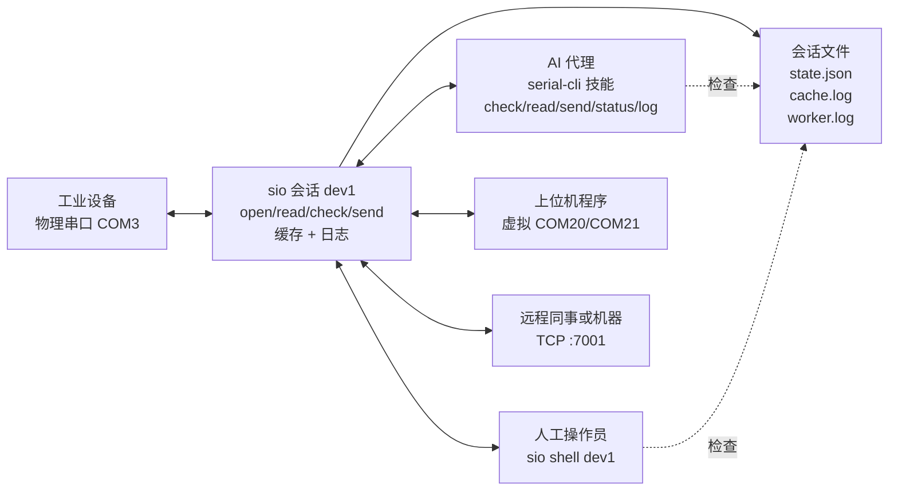
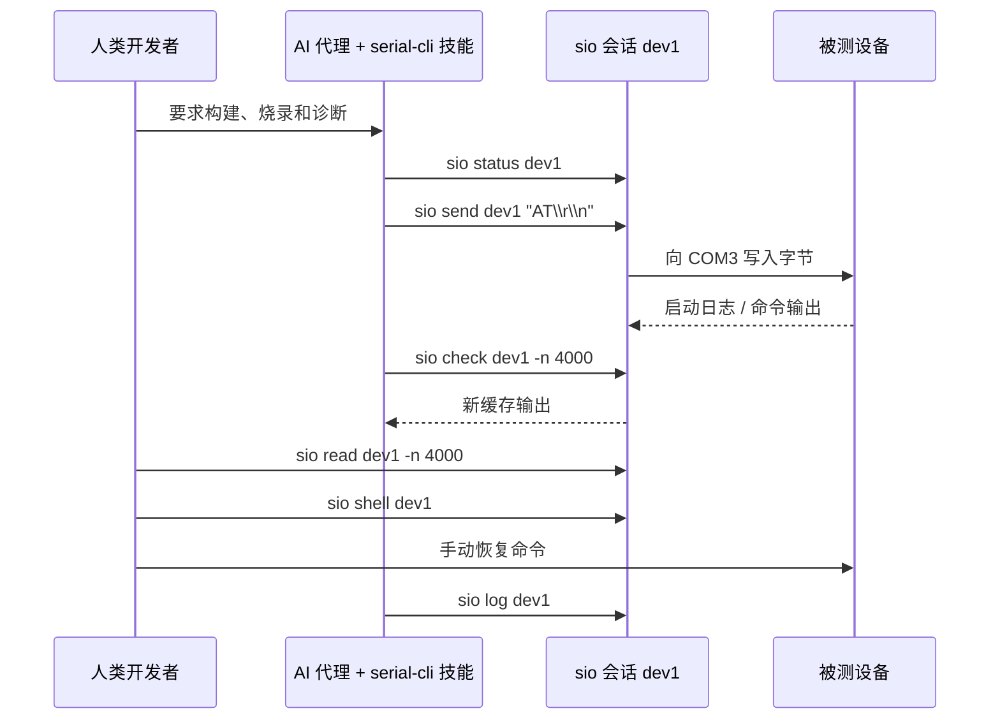
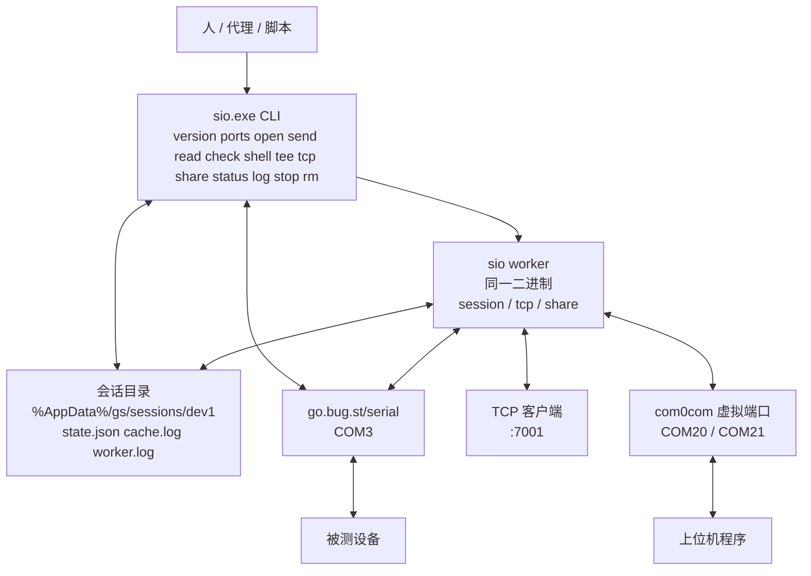
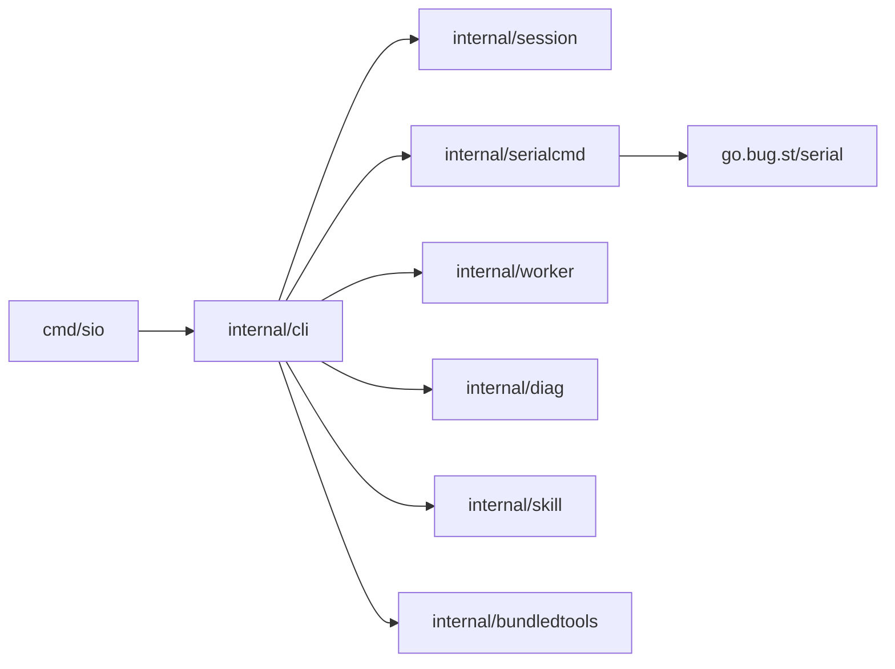

# go-serial-cli

[English](README.md)

`sio` 是一个用于串口工作流的小型 Go CLI，主要面向 Windows。它针对真实调试台设计：工业 PC、厂商工具、上位机、固件烧录，以及人和 AI 代理都需要操作同一台设备的场景。

当前目标是保持简单：一个二进制文件、短命令、本地文件保存状态和日志，并且清理操作只影响你指定的会话。

## 快速开始

```bash
sio version
sio ports
sio open dev1 COM3 -b 115200
sio send dev1 "AT\r\n"
sio ask dev1 "AT\r\n"
sio read dev1 -n 200
sio check dev1 -n 200
sio stop dev1
```

`sio open` 记录一个命名会话，并启动后台 worker 持有物理串口、读取串口输出、追加到 `cache.log`。`send`、`ask`、`read`、`check` 和 `shell` 会通过这个命名会话协作。

```bash
sio shell dev1
sio tee dev1 serial.log
sio tcp dev1 :7001
sio share dev1 COM20 COM21
```

只清理你指定的会话：

```bash
sio stop dev1
sio rm dev1
```

`stop` 释放运行中的资源并保留会话文件。`rm` 执行同样的运行中清理，然后删除该会话的状态、缓存和日志。

## 为什么 Windows 优先

这个项目真正要解决的痛点在 Windows 上。不是因为只有 Windows 才有串口，而是因为真实的上位机调试通常落在 Windows 上：工业 PC、工厂测试台、固件烧录工具、厂商 GUI 程序、USB 驱动和设备手册，往往都是先按 Windows COM 口来设计的。硬件供应商给你的调试软件，大概率也是面向 Windows，而不是让你去接一个 Unix 设备文件。

Linux 和 macOS 在这类工作上已经有更灵活的文件 I/O 模型。串口设备可以像文件一样处理，也可以用 `nc`、`ncat`、`socat`、shell 管道、`tee`、重定向和后台任务组合出很多工作流，效果已经接近本项目想提供的一部分能力。

Windows 默认没有这一套适合串口调试台的工具箱。COM 口经常被 GUI 串口工具、厂商上位机、虚拟 COM 驱动和零散脚本分割开；一个物理串口要同时服务人、AI 代理、厂商工具和远程进程会很别扭；日志常常困在某个 GUI 窗口的滚动历史里；进程和虚拟端口清理也容易误伤。

`sio` 从这里开始。这个项目的目标是把这些 Windows 工作流变得普通而可控：枚举串口、保持命名会话、发送精确字节、缓存输出、检查日志、通过 com0com 共享、暴露 TCP，并且只清理你指定的会话。Linux 支持应保持可行，但项目的核心价值是先解决 Windows 调试台上的痛点。

## 适用人群

当你需要做这些事时，可以使用 `sio`：

- 列出本机串口。
- 给设备命名一次，然后重复发送、读取和增量检查。
- 发送 CRLF、Ctrl+C、ESC、Ctrl+D 等精确字节。
- 在需要人工介入时保持前台串口 shell 或 tee。
- 缓存串口输出，方便人、脚本和 AI 代理后续检查。
- 通过 TCP 暴露串口设备，便于远程控制或观察。
- 通过 com0com 虚拟 COM 端口共享一个物理串口。
- 安装一个教 Codex 或 Claude 使用这个 CLI 的代理技能。

主要平台是 Windows。Linux 支持应保持可行，但 Windows 串口行为、控制台处理、进程清理和 com0com 工作流优先级更高。

## 协作模型

`sio` 不只是给 AI 代理用的小工具。常见硬件调试台上，可能同时有多人或多个进程围绕同一台串口设备工作：人、AI 代理、厂商上位机程序，有时还有远程进程。

典型设置可能是：

- AI 代理通过已安装的技能调用 `sio send`、`sio check`、`sio read`、`sio status` 和 `sio log`。
- 人在设备需要手动恢复时打开 `sio shell dev1`。
- 上位机程序连接到 `sio share dev1 COM20 COM21` 创建的虚拟 COM 端口。
- 远程进程通过 `sio tcp dev1 :7001` 连接。
- 所有人都可以检查同一份缓存和日志，而不是依赖某个终端窗口的滚动历史。

这就是命名会话、缓存输出、`tcp` 和 `share` 存在的主要原因。工具应该让所有权清晰可见，并让清理行为可预测。

## 典型场景

### 共享串口调试台

最重要的场景是一条物理串口旁边有多个观察者或操作者。没有一个小型协调工具时，大家通常会抢 COM 口、丢失终端输出，或者请别人从 GUI 窗口里复制日志。

使用 `sio` 时，先给物理串口命名：

```powershell
sio open dev1 COM3 -b 115200
```

之后，不同工具可以用不同方式接入：

- AI 代理用 `sio check dev1` 读取日志，用 `sio send dev1 "AT\r\n"` 发送精确字节。
- 人在需要判断时打开 `sio shell dev1`。
- 上位机程序连接到 `sio share dev1 COM20 COM21` 创建的虚拟 COM 端口。
- 远程同事或机器通过 `sio tcp dev1 :7001` 连接。
- 所有人都可以检查 `cache.log` 和 `worker.log`。



明确的所有权仍然重要。命令应该说明它正在影响哪个会话，`sio stop dev1` 也应该只清理 `dev1`。这让人、AI 代理和厂商工具同时活跃的调试台也能安全使用。

### AI 代理驱动开发，人保持控制

另一个常见场景是让 AI 代理驱动固件或设备侧开发。代理可以构建代码、烧录开发板、发送串口命令、读取启动日志并总结失败。`sio` 给代理一个小而稳定的串口接口，而不是让它操作 GUI 终端。

人仍然在回路中：

- 读取代理看到的同一份缓存输出。
- 设备需要手动恢复时，用 `sio shell dev1` 介入。
- 在烧录或 flash 前，用 `sio pause dev1` 标记需要独占访问。
- 当代理报告失败时，检查 `sio status dev1` 和 `sio log dev1`。
- 用普通 CLI 命令修改会话，而不是编辑隐藏状态。



这就是技能要支持的操作模式：由代理驱动，但不是只有代理能参与。人可以随时观察、打断并调整方向。

## 当前非目标

`sio` 现在还不是一个基于 daemon 的串口服务。`tcp`、`share` 和会话控制等长时间运行模式会启动后台 worker，但普通使用仍然应该像短 CLI 一样：

```bash
sio open dev1 COM3 -b 115200
sio send dev1 "AT\r\n"
sio check dev1 -n 200
sio stop dev1
```

远程技能仓库、插件执行、依赖管理和自动驱动安装都可以稍后再做。基础命令需要先可靠。

## 安装 sio

目前还没有包管理器或安装器流程。现在从源码安装。

前置条件：

- Go 1.22 或更新版本：https://go.dev/dl/
- 如果要克隆仓库，需要 Git。

在仓库根目录运行：

```powershell
go test ./...
go install ./cmd/sio
```

在 Windows 上，如果未设置 `GOBIN`，Go 会把二进制安装到：

```text
%GOPATH%\bin\sio.exe
```

默认 Go 设置通常是：

```text
C:\Users\<you>\go\bin\sio.exe
```

确保该目录在 `PATH` 中，然后检查实际会运行哪个二进制：

```powershell
Get-Command sio
sio version
```

如果只想本地构建，不安装到 `PATH`：

```powershell
go build -o bin/sio.exe ./cmd/sio
.\bin\sio.exe version
```

带版本元数据的开发构建：

```powershell
$commit = git rev-parse --short HEAD
if (git status --porcelain) { $commit = "$commit-dirty" }
$builtAt = Get-Date -Format "yyyy-MM-ddTHH:mm:sszzz"
go install -ldflags "-X go-serial-cli/internal/cli.BuildVersion=dev -X go-serial-cli/internal/cli.BuildCommit=$commit -X go-serial-cli/internal/cli.BuildBuiltAt=$builtAt" ./cmd/sio
```

### 兼容别名

`sio` 是新文档、脚本和代理指令应使用的规范命令。迁移期间，仓库仍会构建
`gs` 作为短兼容别名：

```powershell
go install ./cmd/gs
Get-Command gs
gs version
```

两个二进制使用同一份会话状态。现有会话文件仍保留在 `%AppData%/gs`；
本次迁移不重命名用户数据目录。
迁移说明见 [docs/sio-rename.md](docs/sio-rename.md)。

## 依赖

构建时 Go 模块由 Go 工具链下载：

- `go.bug.st/serial`: https://pkg.go.dev/go.bug.st/serial
- `golang.org/x/sys`: https://pkg.go.dev/golang.org/x/sys
- `github.com/creack/goselect`: https://pkg.go.dev/github.com/creack/goselect

运行时依赖取决于你使用的功能：

- `version`、`ports`、`open`、`send`、`read`、`check`、`shell`、`tee`、`tcp`、`status`、`log` 等基础命令只需要 `sio.exe`。
- `sio share` 在 Windows 上需要安装 com0com，并且 `setupc.exe` 可通过 `PATH` 或标准 Program Files 安装位置发现。
- `sio share` worker 在 com0com 创建虚拟 COM 对后，使用 `sio` 内置的 Go bridge。

下载 com0com：

```text
com0com 项目站点：https://com0com.com/
com0com SourceForge 项目：https://sourceforge.net/projects/com0com/
```

请手动安装驱动。`sio` 不应该静默安装内核驱动。本仓库不 vendor 或再分发 com0com 安装器。

## 命令模型

### 发现和设置

```bash
sio version
sio -v
sio ports
sio open dev1 COM3 -b 115200
sio list
sio status dev1
```

会话使用名称区分，避免多个设备、终端或代理意外控制彼此的串口资源。会改变状态的命令应只操作一个命名会话，不应顺带影响所有会话。

### 发送字节

```bash
sio send dev1 "AT\r\n"
sio send dev1 "\x03"
sio send dev1 "\cC"
sio send dev1 "\x1b"
sio send dev1 "\x04"
sio ask dev1 "AT\r\n"
sio ask dev1 "ATI\r\n" -t 1.5 -l 5
```

payload 支持显式转义：

| 转义 | 含义 |
| --- | --- |
| `\r` | 回车 |
| `\n` | 换行 |
| `\t` | 制表符 |
| `\xNN` | 一个十六进制字节 |
| `\cX` | ASCII 控制字符 `Ctrl+X` |

`^C` 这样的裸写法只是普通文本。这样可以让字面 payload 保持明确。

`sio ask` 会发送一个 payload，然后在短时间窗口内读取新的串口回传。默认窗口是 0.5 秒，
默认输出最后 50 行。用 `-t <seconds>` 调整窗口，用 `-l <lines>` 输出最后 N 行。
`-l 0` 表示不限制行数。

### 读取缓存输出

```bash
sio read dev1 -n 200
sio read dev1 --to serial-cache.log
sio read dev1 -n 4096 --to recent.log
sio check dev1 -n 200
sio check dev1 --rewind 2000
sio check dev1 --from 0 --to checked.log
sio clear dev1
```

`sio read` 是非破坏性的。它查看 `cache.log`，不会推进游标、消费字节或截断缓存。

`sio check` 是增量读取。它从保存的 check 游标开始读取，并且只把游标推进到已输出的字节。用 `--rewind <bytes>` 从保存游标回退，或用 `--from <offset>` 从绝对缓存偏移检查。

大输出建议使用 `--to <file>`，让 CLI 把数据流式写入文件，而不是倾倒到终端。

### 实时 owner

```bash
sio shell dev1
sio tee dev1 serial.log
sio tcp dev1 :7001
sio share dev1 COM20 COM21
```

`sio shell` 在前台保持命名会话打开，打印串口输出，并把 stdin 写入串口。设备需要 CRLF 时，请输入 `AT\r\n` 这样的转义行尾。在 Windows 上，按一次 Ctrl+C 会向设备发送字节 `0x03`；短时间内第二次中断会退出 shell。

`sio tee` 在前台保持端口打开，并把串口输出写到终端、指定文件和会话缓存。

`sio tcp` 启动后台 worker，接受 TCP 客户端并桥接到命名串口会话。

`sio share` 使用 com0com 和内置 Go 字节桥创建虚拟 COM 共享。驱动安装仍然是显式操作；如果找不到 com0com 的 `setupc.exe`，`sio` 应该给出可操作错误。

### 生命周期和诊断

```bash
sio pause dev1
sio resume dev1
sio status dev1
sio log dev1
sio stop dev1
sio rm dev1
```

`pause` 和 `resume` 更新本地会话状态，用于需要临时独占访问的工作流，例如烧录或 flash。

`status` 报告已保存资源和 PID 存活状态：`running`、`stale` 或 `stopped`。`stale` 表示状态里保存了 PID，但对应进程已经不存在。`sio stop dev1` 仍然应该安全，并且只清理 `dev1`。

## 设计目标

### 保持公开 CLI 简短

命令应该描述用户要完成的工作，而不是暴露内部架构。优先使用：

```bash
sio open dev1 COM3
sio tcp dev1 :7001
```

不要在常规工作流里暴露 `session`、`forward`、`supervisor` 或 `backend` 这类词。

### 让字节明确

串口调试经常依赖精确字节。`sio` 应通过转义明确表达 CRLF、Ctrl+C、ESC、Ctrl+D 和其他控制字节，而不是猜测某种简写是什么意思。

### 把会话当作隔离边界

会话名是安全边界。`sio stop dev1` 和 `sio rm dev1` 不能停止另一个会话、移除另一个设备的虚拟端口或删除无关日志。当多个代理或人同时控制同一台 Windows 机器上的不同设备时，这一点很重要。

### 支持人和代理协作

CLI 必须同时适合人直接使用和代理调用。人需要可读命令、清晰错误和交互式 shell；代理需要稳定输出、缓存文件、增量读取、日志，以及一个说明正确工作流的小技能。

### 让共享成为正常工作流

工业调试经常不止一个观察者。厂商上位机、AI 代理、人工 shell 和远程进程可能都需要围绕同一个物理端口工作。`sio tcp`、`sio share`、缓存文件和日志就是支持这种工作流的组件。

### 优先使用可检查的本地状态

会话状态和日志是用户配置目录下的文件。这让失败可以用普通工具诊断，也避免把重要状态隐藏在可能运行也可能没运行的 daemon 里。

### 驱动安装必须显式

创建虚拟 COM 对需要系统级驱动。`sio share` 使用 com0com，但不应该静默安装驱动。缺少前置条件时，应给出清晰的设置指引。

### 先证明 CLI，再添加 daemon

命令形状、状态模型、清理规则和 Windows 行为应该先稳定下来，再添加 daemon 或 backend 进程。

## 系统架构

`sio` 首先是 CLI。用户运行命令，命令读取或更新用户配置路径下的命名会话目录。有些模式会启动后台 `sio worker`，但该 worker 仍然是同一个二进制文件。没有单独需要安装或管理的 daemon。



普通命令仍然是短生命周期的：

- `sio ports` 通过 `go.bug.st/serial` 查询可用端口。
- `sio open dev1 COM3 -b 115200` 写入 `state.json`，启动后台 session worker，并保持配置的端口打开，直到 `stop` 或 `rm`。
- `sio send dev1 ...` 在 worker 运行时通过 session worker 写入字节。
- `sio ask dev1 ...` 在 worker 运行时通过 session worker 写入字节，然后从新追加的缓存读取一小段回传窗口。
- `sio read` 和 `sio check` 读取 `cache.log`。

实时模式会保持某些资源打开：

- `sio shell` 和 `sio tee` 在前台运行。
- `sio tcp` 记录 TCP 地址，并启动 worker 把 TCP 客户端桥接到串口。
- `sio share` 用 com0com 创建虚拟 COM 对，并启动 worker 运行内置 Go 字节桥。

缓存是共享观察点。worker 和前台读取者把串口输出追加到 `cache.log`；人和代理之后可以读取同一批字节。

## 软件架构

代码按命令解析、串口 I/O、会话文件和辅助工具逻辑拆分。

```text
cmd/sio/                 可执行入口
internal/cli/           命令解析和命令行为
internal/serialcmd/     串口 I/O、流处理、TCP 桥接、会话服务
internal/session/       state.json、cache.log、check 游标、日志路径
internal/worker/        长时间运行 worker 的重试策略
internal/diag/          清晰的用户可见诊断错误
internal/skill/         捆绑技能安装
internal/bundledtools/  已移除第三方捆绑工具的兼容占位
tests/                  按功能分组的行为测试
```

主要依赖方向：



`internal/cli` 负责命令名和用户可见行为。硬件相关代码如果能放在 `internal/serialcmd`、`internal/session` 或小型辅助包里，就不应塞进 CLI 层。

`internal/serialcmd` 负责串口适配层。核心串口行为应通过 `go.bug.st/serial` 实现。不要用 PowerShell、WMI 或临时 OS 命令解析替代正常串口操作。开发期间用 PowerShell 做临时诊断没问题。

`internal/session` 负责本地文件。它应该保持朴素：校验会话名、解析路径、加载和保存状态、读写缓存数据、追加日志。

`internal/skill` 是给代理上下文安装文件，不是插件运行时。

`internal/bundledtools` 是给旧的 `tools extract` 调用保留的兼容占位。第三方可执行文件是外部依赖，不从本仓库分发。

## 会话文件

在 Windows 上，会话文件位于：

```text
%AppData%/gs/sessions/<session>/
```

这里有意保留旧的 `gs` 目录名，确保现有会话能继续被 `sio` 和兼容别名
`gs` 使用。

重要文件：

```text
state.json
cache.log
worker.log
```

使用 `sio log <session>` 查看 `worker.log`，并用它诊断会话和 share worker。

当 `worker_state` 是 `stopped` 时，后台没有新的串口输出追加。`read` 和 `check` 仍然可以检查旧缓存，但它们不是实时设备读取。运行 `sio open <session> <port> -b <baud>` 可以重启 session worker。

## Windows 设置

使用 `sio share` 前，请手动安装 com0com：

```text
com0com 项目站点：https://com0com.com/
com0com SourceForge 项目：https://sourceforge.net/projects/com0com/
```

安装 com0com 后，确保 `setupc.exe` 在 `PATH` 中，或安装在 `Program Files` 下的标准 com0com 位置。

`sio share` 路径会在 com0com 创建虚拟 COM 对后，使用 `sio` 内置的 Go bridge。`sio` 不捆绑或解压第三方可执行文件。

## 技能安装

`sio` 可以为代理上下文安装捆绑的 `serial-cli` 技能：

```bash
sio skill install
sio skill install --to codex
sio skill install --to claude
sio skill install --to ./.tmp-skills
```

默认安装目标是：

```text
~/.codex/skills/serial-cli
~/.claude/skills/serial-cli
```

自定义 `--to <dir>` 会安装到 `<dir>/serial-cli`。这是代理说明文件安装，不是运行时插件系统。

## 路线图

### 1. 稳定 Windows CLI 核心

- 保持 `ports`、`open`、`send`、`shell`、`tee`、`read`、`check`、`clear`、`status`、`log`、`stop`、`rm` 和 `list` 可预测。
- 改进交互式串口 shell 的 Windows 控制台行为。
- 保持精确字节 payload 处理有充分测试。
- 让陈旧进程清理具备幂等性，并严格限制在会话范围内。

### 2. 强化长时间运行所有权

- 改进 `tcp`、`share` 和后台 worker 的诊断与重试行为。
- 保持 worker 和 hub 日志足够支持硬件调试。
- 在 shell、tee、TCP 和虚拟端口共享工作流之间切换会话时，让模式转换更明确。
- 打磨共享端口工作流，让上位机工具、代理、人工 shell 和远程 TCP 客户端在清晰所有权下协作。

### 3. 打磨安装和代理工作流

- 保持 `sio skill install` 最小且无额外依赖。
- 记录在要求人手动测试硬件行为前需要做的 Windows 检查。
- 保持已安装技能与 CLI 实际命令形状一致。

## 构建和测试

```bash
go test ./...
go build -o bin/sio.exe ./cmd/sio
go build -o bin/gs.exe ./cmd/gs
```

Windows 上有用的安全命令检查：

```bash
go run ./cmd/sio version
go run ./cmd/sio help
go run ./cmd/sio ports
go run ./cmd/sio skill install --to ./.tmp-skills
```

`cmd/gs` 入口保留为兼容别名。新用法应优先使用 `cmd/sio`。

手动安装测试后删除 `.tmp-skills`。

要求别人手动测试 CLI 变更前，请先安装二进制并验证当前命令：

```powershell
Get-Command sio
sio version
```

不要提交构建产物或临时安装输出：

```text
bin/
dist/
.tmp-skills/
```

## 故障排查

| 症状 | 首先检查 |
| --- | --- |
| 找不到端口 | 运行 `sio ports`；检查 Windows 设备管理器；不要假设 COM 名称。 |
| `Access is denied` 或端口忙 | 检查 `sio status <session>`，只停止拥有该端口的命名会话，并关闭其他终端或工具。 |
| `read` 或 `check` 没有输出 | 运行 `sio status <session>`；如果已停止，启动 `sio shell`、`sio tee`、`sio tcp` 或 `sio share` 等实时 owner。 |
| `check` 漏了输出 | 使用 `sio check <session> --rewind <bytes>` 或 `--from <offset>`。 |
| Worker 启动失败 | 读取 `worker.log`；`sio status` 可能显示 `worker_error`。 |
| Share 问题 | 读取 `worker.log`；确认已安装 com0com `setupc.exe` 且可被发现。 |
| 陈旧 PID | 运行 `sio stop <session>`；清理逻辑应能处理缺失进程。 |

## 致谢和许可证

`sio` 源码使用 MIT License 发布。详见 `LICENSE`。

`sio` 尊重它可以集成的上游项目。感谢 com0com 项目让 Windows 上实用的虚拟 COM 端口工作流成为可能。

为了保持清晰的许可边界，本仓库不包含 com0com 或其他第三方驱动的二进制、安装器、批处理文件或文档副本。选择使用这些工具的用户，应从上游项目下载，并遵守它们各自的许可证。
